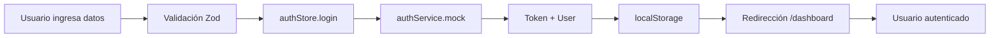
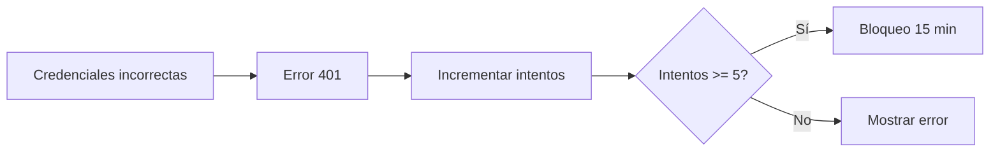
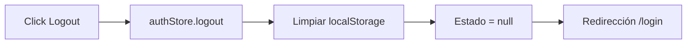

# 🚀 Guía para el Equipo de Frontend - Sistema de Autenticación

> **Última actualización:** Noviembre 2024  
> **Estado:** Sistema de autenticación implementado y funcional con Mock API

---

## 📋 Índice

1. [Resumen Ejecutivo](#resumen-ejecutivo)
2. [Arquitectura del Sistema](#arquitectura-del-sistema)
3. [⚠️ Archivos Críticos - NO MODIFICAR](#archivos-críticos---no-modificar)
4. [Cómo Funciona el Login Actual](#cómo-funciona-el-login-actual)
5. [Flujo de Autenticación](#flujo-de-autenticación)
6. [Dónde Trabajar de Forma Segura](#dónde-trabajar-de-forma-segura)
7. [Guía de Uso para Nuevas Features](#guía-de-uso-para-nuevas-features)
8. [Configuración del Proyecto](#configuración-del-proyecto)
9. [Preguntas Frecuentes](#preguntas-frecuentes)

---

## Resumen Ejecutivo

El sistema de autenticación está **completamente implementado** y funcional. Actualmente usa un **servicio Mock** para simular el backend hasta que los endpoints reales estén listos.

### 🟢 Estado Actual

- ✅ Login funcional con validación
- ✅ Gestión de sesiones con JWT (localStorage)
- ✅ Protección de rutas del dashboard
- ✅ Límite de intentos de login (5 intentos → bloqueo 15 min)
- ✅ Logout funcional
- ✅ UI completa y estilizada

### 🟡 Pendiente

- ⏳ Integración con backend real (cuando esté listo)
- ⏳ Implementar refresh tokens
- ⏳ Migrar a httpOnly cookies (producción)

---

## Arquitectura del Sistema

```
frontend/
├── src/
│   ├── app/
│   │   ├── (auth)/               # Rutas de autenticación (login, register)
│   │   ├── (dashboard)/          # Rutas protegidas del dashboard
│   │   └── layout.tsx            # Layout principal
│   │
│   ├── store/
│   │   └── authStore.ts          # 🔴 CRÍTICO - Estado global de auth
│   │
│   ├── lib/
│   │   ├── api/
│   │   │   ├── authService.ts        # 🔴 CRÍTICO - Servicio HTTP real
│   │   │   └── authService.mock.ts   # Mock temporal (en uso)
│   │   │
│   │   ├── utils/
│   │   │   └── tokenUtils.ts         # 🔴 CRÍTICO - Manejo de tokens
│   │   │
│   │   └── validations/
│   │       └── auth.schema.ts        # Validación de formularios
│   │
│   ├── types/
│   │   └── auth.types.ts         # 🔴 CRÍTICO - Tipos TypeScript
│   │
│   ├── components/
│   │   ├── features/auth/
│   │   │   └── LoginForm.tsx     # 🟡 IMPORTANTE - Formulario de login
│   │   │
│   │   └── shared/
│   │       └── ProtectedRoute.tsx # 🟡 IMPORTANTE - HOC protección
│   │
│   └── middleware.ts             # 🟡 Middleware (actualmente deshabilitado)
│
├── .env.local                    # Variables de entorno (crear)
└── AUTH_IMPLEMENTATION.md        # Documentación técnica detallada
```

---

## ⚠️ Archivos Críticos - NO MODIFICAR

### 🔴 **NIVEL CRÍTICO - NO TOCAR SIN COORDINACIÓN**

Estos archivos son el **núcleo del sistema de autenticación**. Cualquier cambio puede romper todo el flujo:

#### 1. **`src/store/authStore.ts`**
- **Qué hace:** Gestiona el estado global de autenticación con Zustand
- **Contiene:**
  - Estado del usuario (`user`, `token`, `isAuthenticated`)
  - Funciones `login()`, `logout()`, `checkAuth()`
  - Lógica de límite de intentos y bloqueo temporal
- **⚠️ NO modificar:** La lógica de intentos fallidos, el flujo de login/logout
- **✅ Puedes consultar:** `user`, `isAuthenticated`, `isLoading` para usar en tus componentes

```typescript
// ✅ CORRECTO - Solo consumir el estado
const { user, isAuthenticated } = useAuthStore();

// ❌ INCORRECTO - No modificar el estado directamente
useAuthStore.setState({ user: newUser }); // ¡NO HACER ESTO!
```

---

#### 2. **`src/lib/utils/tokenUtils.ts`**
- **Qué hace:** Maneja tokens JWT en localStorage
- **Funciones principales:**
  - `saveToken()`, `getToken()`, `removeToken()`
  - `saveUser()`, `getUser()`, `removeUser()`
  - `isTokenExpired()`, `hasValidSession()`
- **⚠️ NO modificar:** Las claves de localStorage (`auth_token`, `auth_user`)
- **✅ Puedes usar:** Estas funciones si necesitas verificar sesión manualmente

---

#### 3. **`src/lib/api/authService.ts`**
- **Qué hace:** Servicio HTTP para comunicación con el backend
- **⚠️ IMPORTANTE:** Actualmente **NO está en uso**. El sistema usa `authService.mock.ts`
- **🔄 Cambio futuro:** Cuando el backend esté listo, se cambiará el import en `authStore.ts`:

```typescript
// Estado actual en authStore.ts (línea 5)
import { authServiceMock as authService } from "@/lib/api/authService.mock";

// Cambio futuro (solo coordinador hace esto)
import { authService } from "@/lib/api/authService";
```

---

#### 4. **`src/types/auth.types.ts`**
- **Qué hace:** Define todos los tipos TypeScript de autenticación
- **Tipos principales:**
  - `User`: Datos del usuario (`id`, `email`, `name`, `role`)
  - `LoginCredentials`: Datos del formulario de login
  - `LoginResponse`: Respuesta del backend
- **⚠️ NO modificar:** Los tipos base sin consultar con el equipo
- **✅ Puedes:** Agregar tipos adicionales si lo necesitas

---

### 🟡 **NIVEL IMPORTANTE - MODIFICAR CON CUIDADO**

#### 5. **`src/components/features/auth/LoginForm.tsx`**
- **Qué hace:** Formulario de inicio de sesión
- **✅ Puedes modificar:** Estilos, textos, UX
- **⚠️ NO modificar sin coordinación:** La lógica de `handleSubmit`, integración con `useAuthStore`

---

#### 6. **`src/app/(dashboard)/layout.tsx`**
- **Qué hace:** Layout del dashboard con sidebar y header
- **Usa autenticación para:**
  - Mostrar nombre del usuario en el header
  - Botón de logout
- **✅ Puedes modificar:** UI del sidebar, estilos, navegación
- **⚠️ Ten cuidado con:** La función `handleLogout()`, el hook `useAuthStore()`

```typescript
// ✅ CORRECTO - Usar estos valores
const { user, logout } = useAuthStore();

// Nombre del usuario
{user?.name || "Usuario"}

// Logout
const handleLogout = async () => {
  await logout();
  router.push("/login");
};
```

---

#### 7. **`src/middleware.ts`**
- **Estado actual:** **DESHABILITADO** (línea 20)
- **Por qué:** El Mock usa localStorage, no cookies
- **🔄 Futuro:** Se activará cuando el backend use cookies httpOnly
- **⚠️ NO activar** sin coordinación con el backend

---

## Cómo Funciona el Login Actual

### 1. **Usuario ingresa credenciales**
```
LoginForm.tsx → Validación con Zod → handleSubmit()
```

### 2. **Se llama a la función login del store**
```typescript
const success = await login({ email, password, rememberMe });
```

### 3. **El store usa el servicio Mock**
```typescript
// authStore.ts (línea 5)
import { authServiceMock as authService } from "@/lib/api/authService.mock";
```

### 4. **El Mock simula respuesta del backend**
```typescript
// authService.mock.ts
// Devuelve un token JWT fake y datos del usuario
{
  token: "eyJhbGciOiJIUzI1NiIsInR5cCI6IkpXVCJ9...",
  user: {
    id: "1",
    email: "admin@example.com",
    name: "Admin User",
    role: "admin"
  }
}
```

### 5. **Se guardan datos en localStorage**
```typescript
// tokenUtils.ts
localStorage.setItem("auth_token", token);
localStorage.setItem("auth_user", JSON.stringify(user));
```

### 6. **Redirección automática**
```typescript
if (success) {
  router.push("/dashboard");
}
```

### 7. **Dashboard carga datos del usuario**
```typescript
const { user } = useAuthStore();
// Muestra: Hola, Admin User
```

---

## Flujo de Autenticación

### 🔐 Login Exitoso



### ❌ Login Fallido



### 🚪 Logout



---

## Dónde Trabajar de Forma Segura

### ✅ **Áreas Seguras para Desarrollar**

#### 1. **Nuevas páginas del Dashboard**
```
src/app/(dashboard)/mi-nueva-pagina/page.tsx
```

**Ejemplo:**
```typescript
"use client"
import { useAuthStore } from "@/store/authStore";

export default function MiPagina() {
  const { user, isAuthenticated } = useAuthStore();

  if (!isAuthenticated) return null;

  return (
    <div>
      <h1>Hola {user?.name}</h1>
      {/* Tu código aquí */}
    </div>
  );
}
```

---

#### 2. **Componentes de UI**
```
src/components/ui/
src/components/shared/
```

**Puedes crear cualquier componente visual sin afectar la autenticación.**

---

#### 3. **Estilos y Tailwind**
```
src/app/globals.css
tailwind.config.ts
```

**Modifica estilos libremente.**

---

### ⚠️ **Áreas de Riesgo - Coordinar Cambios**

| Archivo | Riesgo | Qué consultar |
|---------|--------|---------------|
| `authStore.ts` | 🔴 Alto | Cualquier cambio en lógica de login/logout |
| `tokenUtils.ts` | 🔴 Alto | Cambios en claves de localStorage |
| `authService.ts` | 🟡 Medio | Endpoints del backend |
| `LoginForm.tsx` | 🟡 Medio | Lógica de submit, validación |
| `layout.tsx` (dashboard) | 🟡 Medio | Función de logout, datos de usuario |
| `middleware.ts` | 🟡 Medio | No activar sin backend real |

---

## Guía de Uso para Nuevas Features

### 🎯 Caso 1: Quiero acceder a datos del usuario

```typescript
"use client"
import { useAuthStore } from "@/store/authStore";

export default function MiComponente() {
  const { user, isAuthenticated, isLoading } = useAuthStore();

  if (isLoading) return <div>Cargando...</div>;
  if (!isAuthenticated) return <div>No autenticado</div>;

  return (
    <div>
      <p>Email: {user?.email}</p>
      <p>Nombre: {user?.name}</p>
      <p>Rol: {user?.role}</p>
    </div>
  );
}
```

---

### 🎯 Caso 2: Quiero proteger una ruta

**Opción A: Usar el middleware (cuando esté activo)**
```typescript
// middleware.ts ya protege las rutas del dashboard
```

**Opción B: Proteger manualmente**
```typescript
"use client"
import { useAuthStore } from "@/store/authStore";
import { useRouter } from "next/navigation";
import { useEffect } from "react";

export default function PaginaProtegida() {
  const { isAuthenticated } = useAuthStore();
  const router = useRouter();

  useEffect(() => {
    if (!isAuthenticated) {
      router.push("/login");
    }
  }, [isAuthenticated, router]);

  if (!isAuthenticated) return null;

  return <div>Contenido protegido</div>;
}
```

---

### 🎯 Caso 3: Quiero hacer un logout

```typescript
"use client"
import { useAuthStore } from "@/store/authStore";
import { useRouter } from "next/navigation";

export default function MiComponente() {
  const { logout } = useAuthStore();
  const router = useRouter();

  const handleLogout = async () => {
    await logout();
    router.push("/login");
  };

  return (
    <button onClick={handleLogout}>
      Cerrar Sesión
    </button>
  );
}
```

---

### 🎯 Caso 4: Quiero proteger por rol (admin/member)

```typescript
"use client"
import { useAuthStore } from "@/store/authStore";

export default function AdminPanel() {
  const { user, isAuthenticated } = useAuthStore();

  if (!isAuthenticated || user?.role !== "admin") {
    return <div>Acceso denegado. Solo administradores.</div>;
  }

  return (
    <div>
      {/* Panel de admin */}
    </div>
  );
}
```

---

### 🎯 Caso 5: Quiero agregar un campo al usuario

**1. Modifica el tipo en `auth.types.ts`:**
```typescript
export interface User {
  id: string;
  email: string;
  name: string;
  role: "admin" | "member";
  // ✅ Agrega tu campo aquí
  avatar?: string;
  phone?: string;
}
```

**2. Actualiza el Mock en `authService.mock.ts`:**
```typescript
user: {
  id: "1",
  email: "admin@example.com",
  name: "Admin User",
  role: "admin",
  // ✅ Agrega el valor aquí
  avatar: "https://example.com/avatar.jpg",
  phone: "+1234567890",
}
```

**3. Coordina con el backend** para que devuelva ese campo en la respuesta real.

---

## Configuración del Proyecto

### 1. **Clonar y configurar**

```bash
# Instalar dependencias
npm install

# Crear archivo de entorno
cp env.example.txt .env.local
```

### 2. **Archivo `.env.local`**

```env
NEXT_PUBLIC_API_URL=http://localhost:3000
```

**⚠️ Importante:** Cuando el backend esté listo, ajusta esta URL.

---

### 3. **Credenciales de prueba (Mock)**

El Mock acepta estas credenciales:

| Email | Contraseña | Rol |
|-------|------------|-----|
| `admin@example.com` | `admin123` | admin |
| `user@example.com` | `user123` | member |

---

### 4. **Ejecutar en desarrollo**

```bash
npm run dev
# Abre: http://localhost:3000
```

---

## Preguntas Frecuentes

### ❓ ¿Puedo modificar el LoginForm.tsx?

**Sí**, pero con cuidado:
- ✅ Estilos, textos, UI
- ⚠️ Lógica de submit (coordinar)
- ❌ No cambiar la integración con `useAuthStore`

---

### ❓ ¿Cómo sé si un usuario está autenticado?

```typescript
const { isAuthenticated } = useAuthStore();
```

---

### ❓ ¿Puedo agregar más campos al formulario de login?

**Sí**, pero:
1. Actualiza `auth.schema.ts` (validación Zod)
2. Actualiza `auth.types.ts` (tipos TypeScript)
3. Coordina con el backend para que acepte esos campos

---

### ❓ ¿Por qué no funciona el middleware?

Está **intencionalmente deshabilitado** (línea 20 de `middleware.ts`) porque el Mock usa localStorage. Se activará cuando el backend esté listo y use cookies.

---

### ❓ ¿Cuándo se cambiará al authService real?

Cuando el backend implemente los endpoints:
- `POST /api/auth/login`
- `POST /api/auth/logout`
- `GET /api/auth/verify`

El coordinador cambiará **solo esta línea** en `authStore.ts`:
```typescript
// De esto:
import { authServiceMock as authService } from "@/lib/api/authService.mock";

// A esto:
import { authService } from "@/lib/api/authService";
```

---

### ❓ ¿Qué pasa si modifico algo crítico por error?

1. **Git es tu amigo:** Revierte con `git checkout -- archivo.ts`
2. **Consulta con el equipo** antes de hacer push
3. **Revisa los tests** (cuando los haya)

---

### ❓ ¿Cómo sé qué archivos cambié?

```bash
git status
git diff src/store/authStore.ts
```

---

## 🚨 Checklist antes de hacer Push

- [ ] ✅ No modifiqué `authStore.ts` sin coordinación
- [ ] ✅ No modifiqué `tokenUtils.ts` sin coordinación  
- [ ] ✅ No modifiqué las claves de localStorage
- [ ] ✅ No activé el middleware sin backend real
- [ ] ✅ Probé mi código en local
- [ ] ✅ El login sigue funcionando
- [ ] ✅ El logout sigue funcionando
- [ ] ✅ No hay errores en la consola
- [ ] ✅ Mi código sigue las reglas de ESLint
- [ ] ✅ Documenté cambios importantes

---

## 📞 Contacto

**Si tienes dudas sobre:**
- Autenticación → Contactar al coordinador/lead
- UI/UX → Modificar libremente
- Nuevas features → Consultar antes de tocar archivos críticos

---

## 📚 Documentación Adicional

- **Documentación técnica detallada:** `AUTH_IMPLEMENTATION.md`
- **Zustand:** https://docs.pmnd.rs/zustand
- **Next.js:** https://nextjs.org/docs
- **TypeScript:** https://www.typescriptlang.org/docs

---

## 🎯 Resumen Visual

```
┌─────────────────────────────────────────┐
│  🔴 NO TOCAR SIN COORDINACIÓN           │
│                                         │
│  - authStore.ts                         │
│  - tokenUtils.ts                        │
│  - authService.ts                       │
│  - auth.types.ts                        │
└─────────────────────────────────────────┘

┌─────────────────────────────────────────┐
│  🟡 MODIFICAR CON CUIDADO               │
│                                         │
│  - LoginForm.tsx                        │
│  - layout.tsx (dashboard)               │
│  - middleware.ts                        │
└─────────────────────────────────────────┘

┌─────────────────────────────────────────┐
│  🟢 ÁREA SEGURA - TRABAJA LIBREMENTE    │
│                                         │
│  - Nuevas páginas en (dashboard)/      │
│  - Componentes UI                       │
│  - Estilos                              │
│  - Assets                               │
└─────────────────────────────────────────┘
```

---

**Última actualización:** Noviembre 2024  
**Versión del documento:** 1.0  
**Mantenedor:** Tu nombre / Coordinador del equipo
